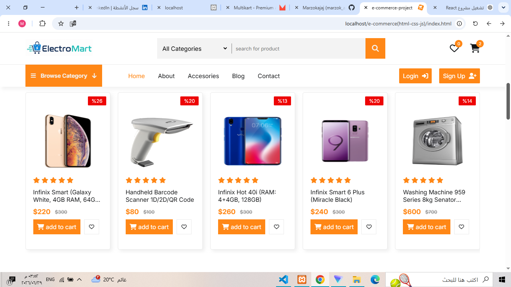
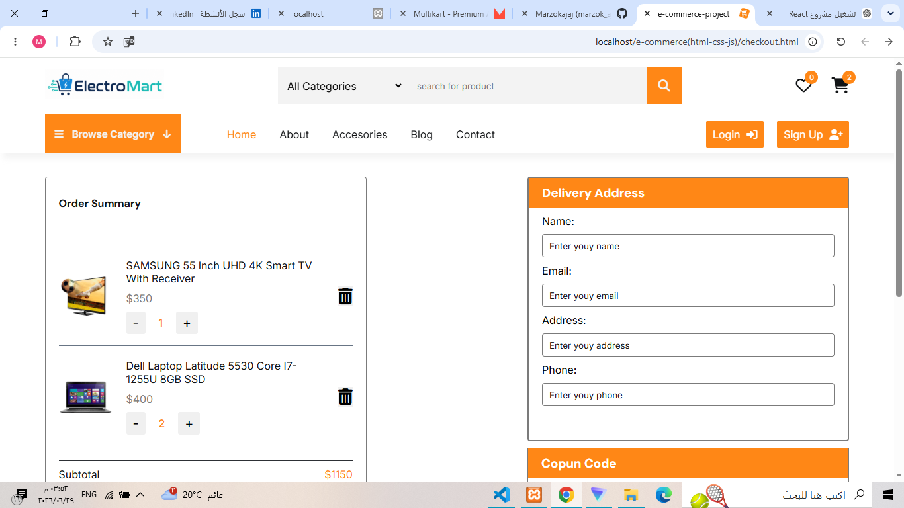

# Static E-commerce Frontend

A static e-commerce frontend project built with HTML, CSS, and JavaScript.

This project includes a home page, product sliders, shopping cart, product data loaded from JSON, LocalStorage cart management, and a checkout page.

---

## Live Demo

[View Project Live](https://marzokajaj.github.io/static-ecommerce-frontend/)


## Features

- Responsive e-commerce homepage
- Product sections
- Product data loaded from JSON
- Shopping cart sidebar
- Add products to cart
- Increase and decrease product quantity
- Remove products from cart
- Cart data saved in LocalStorage
- Checkout page
- Order summary
- Swiper sliders
- Font Awesome icons

---

---

## Project Screenshots

### Home Page



### Checkout Page




## Technologies Used

- HTML
- CSS
- JavaScript
- JSON
- LocalStorage
- Swiper.js
- Font Awesome

---

## Project Structure

```text
index.html
checkout.html
products.json
css/
  style.css
js/
  main.js
  items_home.js
  swiper.js
img/
README.md
```

---

## How to Run the Project

This project uses JavaScript `fetch()` to load products from `products.json`.

Because of that, do not open the project by double-clicking `index.html`.

Do not use:

```text
file:///C:/...
```

Use a local server instead.

---

## Run Using XAMPP

1. Put the project folder inside:

```text
C:/xampp/htdocs
```

2. Start Apache from XAMPP.

3. Open the project from the browser:

```text
http://localhost/ecommerce-html-css-js/index.html
```

If your folder has a different name, replace:

```text
ecommerce-html-css-js
```

with your actual folder name.

---

## Pages

Home page:

```text
index.html
```

Checkout page:

```text
checkout.html
```

---

## Notes

This project is a frontend-only e-commerce demo.

It does not include:

- Backend
- Real authentication
- Real payment
- Real orders database
- Admin dashboard

The cart is stored using browser LocalStorage.

---

## Future Improvements

- Fix UI text and spelling mistakes
- Add product details page
- Add search functionality
- Add category filtering
- Improve responsive design
- Add wishlist functionality
- Improve checkout form validation
- Add real backend with Laravel or Node.js

---

## Author

Marzok Ajaj
